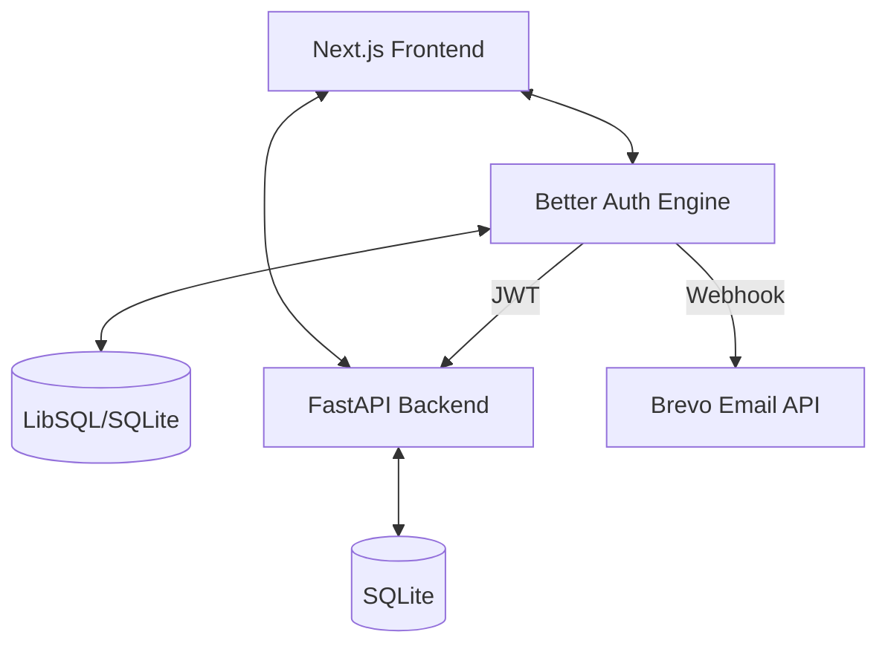

# 🚀 Full-Stack Todo App (Next.js + FastAPI)

A modern, high-performance Todo application featuring robust authentication with **Better Auth**, a secure **FastAPI** backend, and a beautiful **Next.js** frontend.

> [!IMPORTANT]
> **Written Walkthrough**: Detailed project documentation, including architecture, features, and deep-dive technical guides, can be found in the **[WALKTHROUGH.md](WALKTHROUGH.md)** file. This serves as the primary deliverable for the assignment explanation.

## ✨ Features

- **🔐 Secure Authentication**: Integrated with Google OAuth and Passkeys (WebAuthn) via [Better Auth](https://better-auth.com).
- **🛡️ JWT Handshake**: Custom JWT validation middleware in FastAPI using `PyJWT` and asymmetric `JWKS` key rotation.
- **📧 Transactional Emails**: Welcome emails triggered via Brevo API on successful registration.
- **⚡ Fast API**: Backend powered by FastAPI with SQLAlchemy.
- **🗄️ Database Flexibility**: Support for local **SQLite** (development) and **LibSQL/Turso** (production-grade persistence).
- **🎨 Premium UI**: Responsive dashboard built with Tailwind CSS, Lucide icons, and Sonner toast notifications.
- **🧪 Tested**: Comprehensive unit tests for both Frontend (Jest) and Backend (Pytest).

## 🏗️ Architecture



### Key Technical Decisions

#### 1. JWT Integration: JWKS (JSON Web Key Set)
**The Choice**: I chose to use asymmetric signing (EdDSA) instead of a simple symmetric secret (HS256). The frontend serves the public keys at `/api/auth/jwks`, which the FastAPI backend fetches and caches dynamically.

**Rationale & Tradeoffs**: 
- **Security**: Asymmetric signing ensures the backend only needs the public key to verify tokens. If the backend is compromised, the attacker cannot forge new tokens.
- **Decoupling**: The backend doesn't need to share a secret string with the frontend, making it easier to rotate keys without redeploying both services.
- **Tradeoff**: It adds a slight overhead to the first request (fetching the JWKS), but this is mitigated by caching the keys in the backend.

#### 2. Email Delivery: Brevo API
**Sender Domain**: `gmail.com` (rizts.tech@gmail.com)
**Implementation**: I utilized raw Fetch API calls to Brevo's REST endpoint to avoid compatibility issues between the Brevo SDK and Next.js 15 (Turbopack).

#### 3. Persistence: LibSQL (Turso)
To handle the ephemeral nature of serverless platforms (like Vercel), we utilize **LibSQL (Turso)** for authentication data, ensuring sessions are persistent and globally available.

## 🛠️ Setup Instructions

### 1. Backend (FastAPI)
```bash
cd backend
python -m venv venv
source venv/bin/activate
pip install -r requirements.txt
uvicorn main:app --reload
```

### 2. Frontend (Next.js)
```bash
cd frontend
npm install
npm run dev
```

### 3. Environment Variables

Create a `.env.local` in `frontend/`:
```env
# Better Auth
BETTER_AUTH_SECRET=your_secret_here
BETTER_AUTH_URL=http://localhost:3000

# Database (Production: LibSQL/Turso)
DATABASE_URL=libsql://your-db-url
LIBSQL_AUTH_TOKEN=your-auth-token

# OAuth
GOOGLE_CLIENT_ID=your_google_id
GOOGLE_CLIENT_SECRET=your_google_secret

# Email (Brevo)
BREVO_API_KEY=your_brevo_api_key
BREVO_SENDER_NAME="Todo App"
BREVO_SENDER_EMAIL=your_verified_sender_email

# API
NEXT_PUBLIC_API_URL=http://localhost:8000

# Docker/Internal Networking (Optional)
# Used by backend to reach frontend internally in Docker
INTERNAL_AUTH_URL=http://frontend:3000
```

Create a `.env` in `backend/`:
```env
FRONTEND_URL=http://localhost:3000
DATABASE_URL=sqlite:///./todo.db
```

## 🧪 Running Tests

### Backend
```bash
cd backend
pytest
```

### Frontend
```bash
cd frontend
npm test
```

## 🐳 Docker Setup
Run the entire stack with:
```bash
docker-compose up --build
```
