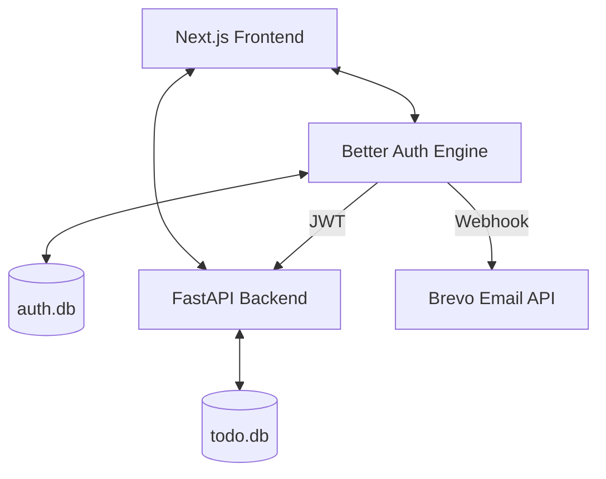

# 🚀 Full-Stack Todo App (Next.js + FastAPI)

A modern, high-performance Todo application featuring robust authentication with **Better Auth**, a secure **FastAPI** backend, and a beautiful **Next.js** frontend.

> [!NOTE]
> Detailed project documentation, including architecture, features, and deep-dive technical guides, can be found in the **[WALKTHROUGH.md](WALKTHROUGH.md)** file.

## ✨ Features

- **🔐 Secure Authentication**: Integrated with Google OAuth and Passkeys (WebAuthn) via [Better Auth](https://better-auth.com).
- **🛡️ JWT Handshake**: Custom JWT validation middleware in FastAPI using `PyJWT` and asymmetric `JWKS` key rotation.
- **📧 Transactional Emails**: Welcome emails triggered via Brevo API on successful registration (Sender Domain: `mailin.fr` / `yourtodoapp.com`).
- **⚡ Fast API**: Backend powered by FastAPI with SQLite and SQLAlchemy.
- **🎨 Premium UI**: Responsive dashboard built with Tailwind CSS, Lucide icons, and Sonner toast notifications.
- **🧪 Tested**: Comprehensive unit tests for both Frontend (Jest) and Backend (Pytest).

## 🏗️ Architecture



### Key Technical Decisions

1.  **JWKS (JSON Web Key Set)**: Unlike basic symmetric tokens (HS256), we use asymmetric signing. The frontend serves public keys at `/api/auth/jwks`, which the backend fetches and caches. This allows for seamless key rotation without manual configuration.
2.  **PyJWT Migration**: We migrated from `python-jose` to `PyJWT` to support the `EdDSA` algorithm required by modern authentication standards.
3.  **Better Auth**: Chosen over NextAuth for its superior developer experience, built-in Passkey support, and framework-agnostic core.

## 🛠️ Setup Instructions

### 1. Backend (FastAPI)
```bash
cd backend
python -m venv venv
source venv/bin/activate
pip install -r requirements.txt
uvicorn main:app --reload
```

### 2. Frontend (Next.js)
```bash
cd frontend
npm install
npm run dev
```

### 3. Environment Variables

Create a `.env.local` in `frontend/`:
```env
# Better Auth
BETTER_AUTH_SECRET=your_secret_here
BETTER_AUTH_URL=http://localhost:3000

# OAuth
GOOGLE_CLIENT_ID=your_google_id
GOOGLE_CLIENT_SECRET=your_google_secret

# Email (Brevo)
BREVO_API_KEY=your_brevo_api_key
BREVO_SENDER_EMAIL=your_verified_sender_email
```

Create a `.env` in `backend/` (optional, defaults are provided):
```env
JWKS_URL=http://localhost:3000/api/auth/jwks
DATABASE_URL=sqlite:///./todo.db
```

## 🧪 Running Tests

### Backend
```bash
cd backend
./venv/bin/pytest
```

### Frontend
```bash
cd frontend
npm test
```

## 🐳 Docker Setup
Run the entire stack with:
```bash
docker-compose up --build
```
